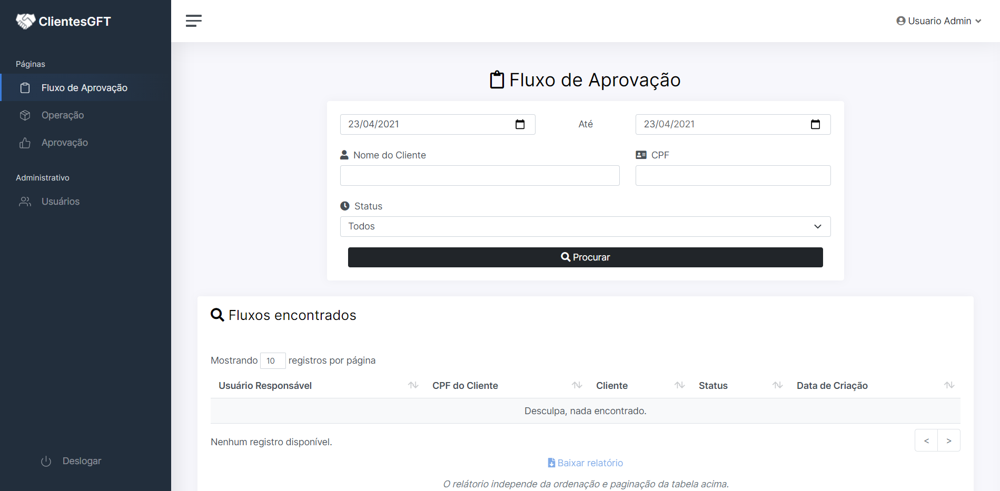
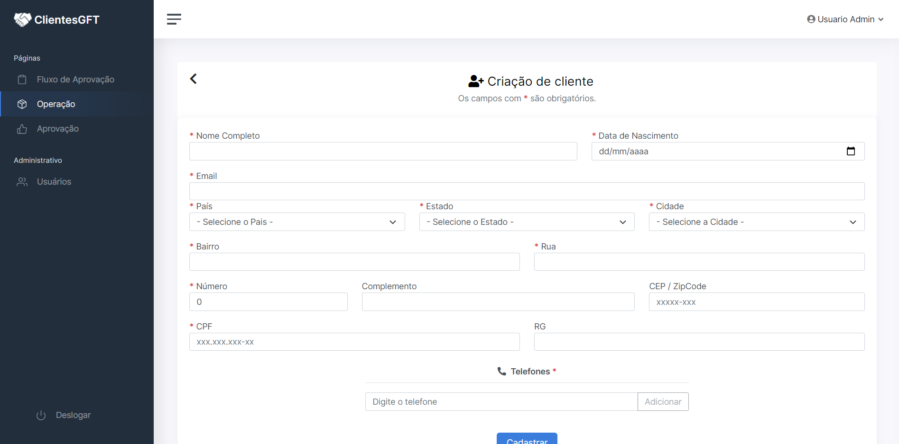
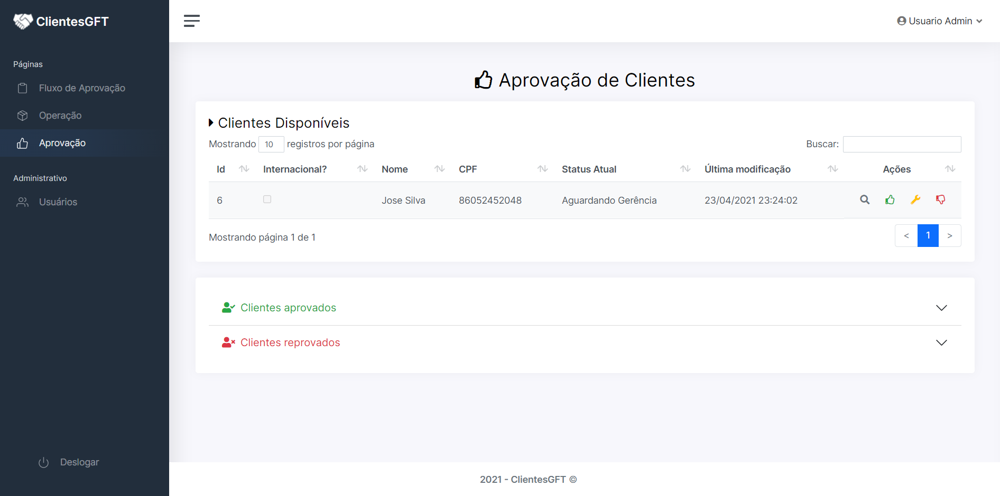

<h1 align="center">CLIENTES GFT</h1>
<h4 align="center">Sistema de Prospecção de clientes, no qual controla o fluxo de aprovação de clientes internacionais e nacionais. Desenvolvido no programa Start, da GFT Brasil</h4>

# 🤔 O que é o programa Start?

Criado pela GFT, o Programa START foi concebido com o objetivo de formar e desenvolver jovens profissionais segundo os valores e competências da GFT. Durante o estágio, os STARTERS, como nossos estagiários são chamados, irão passar por diferentes etapas, de forma a se tornar um profissional preparado a enfrentar os mais diversos desafios.

# 🖥 Prints

# 💡 Tecnologias

Esse projeto foi desenvolvido com as seguintes tecnologias:

- [ASPNet Core 3.1](https://dotnet.microsoft.com/download/dotnet-core/3.1)
- [Entity Framework](https://www.entityframeworktutorial.net/what-is-entityframework.aspx)
- [SQL Server](https://www.microsoft.com/pt-br/sql-server/sql-server-downloads)
- [Bootstrap](https://getbootstrap.com/)

